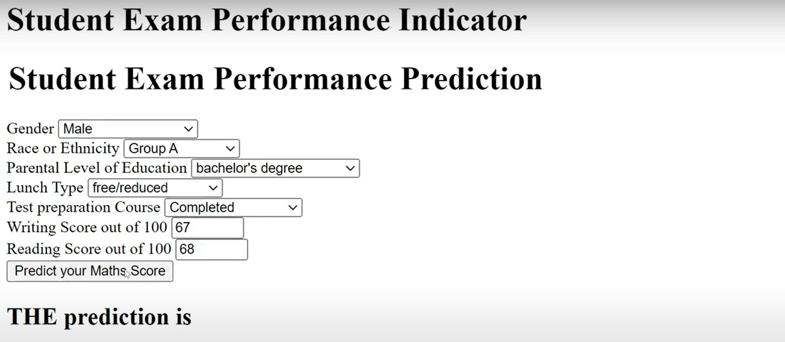
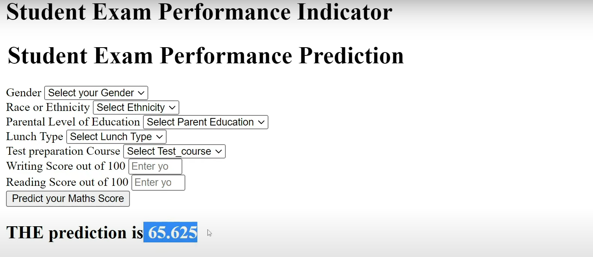

# Student Marks Performance Indicator Prediction Using Machine Learning


## 🎯 Objective:
The goal of this project is to build a machine learning model that predicts students' marks based on various features such as study hours, attendance, previous exam scores, and demographic information. The model will help educators and administrators predict student performance, identify at-risk students, and personalize learning strategies to improve academic outcomes.

### 📷 **Screenshots**




---

## 📊 Model Accuracy:
- **Accuracy:** 93%  
  This indicates that the model correctly predicts student marks with 93% accuracy, providing reliable insights into student performance.
- **MAE (Mean Absolute Error):** 6.72  
  This means the model's predictions deviate by an average of 6.72 marks from the actual values.
- **RMSE (Root Mean Square Error):** 8.5  
  This error margin provides a good indication of how far off the predictions are from the true values on average.

## 🛠️ Tech Stack:
### Development Environment:
- 🖥️ **VS Code:** For writing and executing code.
- 📓 **Jupyter Notebook:** Used for running Python scripts interactively.

### Programming Language:
- 🐍 **Python:** The entire project is implemented in Python.

### Machine Learning Libraries:
- 📚 **Scikit-learn:** For training machine learning regression models to predict student marks.
- 🐼 **Pandas & 🧮 NumPy:** For data preprocessing and manipulation.
- 📊 **Matplotlib & Seaborn:** For data visualization.
- 🛠️ **XGBoost:** For improved model performance and predictions.

## 🛤️ Roadmap:
### 1️⃣ Understanding the Problem and Dataset:
- **Objective:** Predict student marks based on various factors.
- **Dataset:** Contains features such as:
  - Study Hours, Attendance Percentage, Previous Exam Scores, Gender, Age, Parental Education, and Marks (Target).

### 2️⃣ Data Collection & Exploration:
- **📊 Acquire the Dataset:** The dataset includes student demographic and academic data.
- **🔍 Exploratory Data Analysis (EDA):**
  - **Unique Values:** Checked for categorical data to understand the diversity in features.
  - **Missing Values:** Checked and handled using imputation or removal.
  - **Outliers:** Detected using box plots and removed when necessary to avoid skewed results.

### 3️⃣ Data Preprocessing:
- **🧹 Handling Missing Values:** Used imputation techniques for missing data based on the feature type.
- **🏗️ Feature Engineering:**
  - Categorical features (like Gender and Parental Education) were encoded using one-hot encoding.
  - Numerical features were scaled if necessary to improve model performance.
- **✂️ Train-Test Split:** Split the dataset into training and testing sets with a 70:30 ratio using **train_test_split** from **Scikit-learn**.

### 4️⃣ Model Building & Model Selection:
- **Algorithms Used:**
  - Linear Regression
  - Decision Tree Regressor
  - Random Forest Regressor
  - Support Vector Machine (SVM) Regressor
  - XGBoost Regressor
- **Note:** Random Forest and XGBoost were selected as primary models due to their high accuracy and ability to handle non-linear relationships.

### 5️⃣ Testing the Output:
- **Model's Performance:** Evaluated using **accuracy**, **MAE**, and **RMSE**:
  - **Accuracy:** 93%
  - **MAE:** 6.72
  - **RMSE:** 8.5

### 6️⃣ Deployment Configuration (AWS):
- **Added templates folder** containing **home.html** and **index.html** for web interface.
- **Hyperparameter Training** for fine-tuning model performance.
- **EDA and Problem Statements** defined and documented for transparency.
- **Prediction Pipeline** implemented for real-time predictions on student marks.
- **Model Trainer** developed to automate model training with updated data.
- **Data Transformation** completed to ensure proper input formatting.
- **First Commit** made to version control repository to track development progress.

### 7️⃣ Setup & Additional Features:
- The project is set up for deployment on **AWS** to serve real-time predictions.
- **UI Interface** created with **HTML** templates to interact with the model.

## 🚀 How to Run:
1. Clone the repository:
   ```bash
   git clone https://github.com/MdSaad07/Student-Marks-Performance-Indicator-Prediction.git
